Homework 3
================
Tanmay Gupta
3/12/2018

Introduction
------------

In this homework assignment I will explore data I collected from the World Health Oranization ("WHO" henceforth). The dataset has 8 columns and 174 rows. All data in this dataset are for the year 2015. Following are the explanations for each variable:

-   ***Both Sex Life Expectancy:*** Measures the average life expectancy for both sexes in a country. This will be the response variable in my regression analysis.

-   ***Both Sex Mortality Rate:*** Measures the average rate of deaths for both sexes in a country. In essence, it measures the probablity of dying between the age of 15 and 60 years. This will be a predictor variable in my regression analysis.

-   ***GDP Per Capita:*** Measures the per capita GDP for a country. This number is adjusted for purchasing power parity. This will be a predictor variable in my regression analysis.

-   ***Both Sex BMI:*** Measures the average body mass index (BMI) for the population in a country. It is weighted according to the population distrubution for a country. This will be a predictor variable in my regression analysis.

-   ***Suicide Rate:*** Measures the rate of suicides for a country. I'll be using this as a proxy for mental health in the country. This will be a predictor variable in my regression analysis.

-   ***Child Mortality Rate:*** Measures the rate of children who die under the age of 1 years for a country. This will be a predictor variable in my regression analysis.

-   ***Continent:*** Indicates the continent the country is a part of. This will be a predictor in my regression analysis.

Following are the first few rows of the dataset to give a general idea of the data I will be working with.

    ##               Country Life_Expectancy Mortality   GDP  BMI Suicide_rate
    ## 1         Afghanistan            52.3     0.263  1900 23.3     0.000071
    ## 2             Albania            68.8     0.074 12500 26.6     0.000038
    ## 3             Algeria            66.3     0.109 15100 25.5     0.000031
    ## 4              Angola            45.9     0.335  6800 23.2     0.000259
    ## 5 Antigua and Barbuda            67.2     0.130 26300 26.6     0.000000
    ## 6           Argentina            67.6     0.116 20700 27.6     0.000139
    ##   Child_Mortality     Continent
    ## 1          0.0549          Asia
    ## 2          0.0125        Europe
    ## 3          0.0219        Africa
    ## 4          0.0569        Africa
    ## 5          0.0053 North America
    ## 6          0.0103 South America

Data Exploration
----------------

#### GDP per Capita

We will immediately begin exploring the data and general trends that are prevalent.

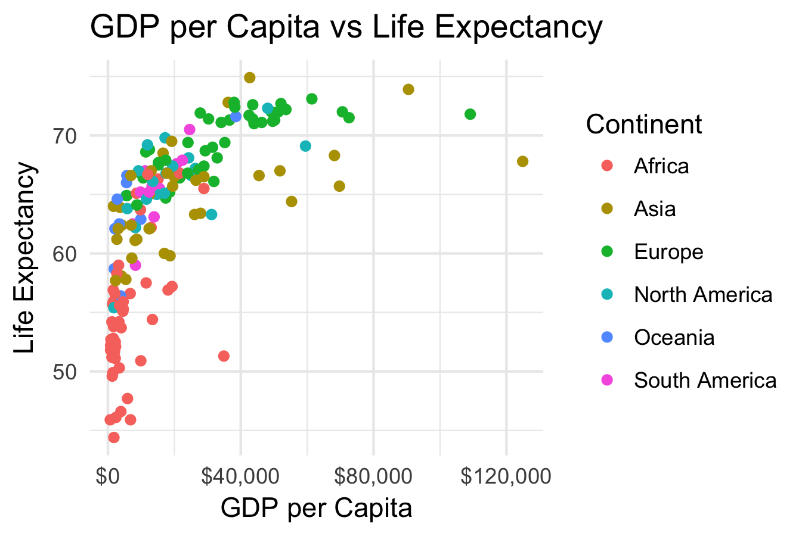

Since we can see that the values are fanning out towards the right side, we can suspect that since the **GDP per Capita** value is a monetary value, we may have to transform that into its log scale.

Before converting the **GDP per Capita** value into a *log* scaled value, I will check whether it's histogram distribution has a long right tail.

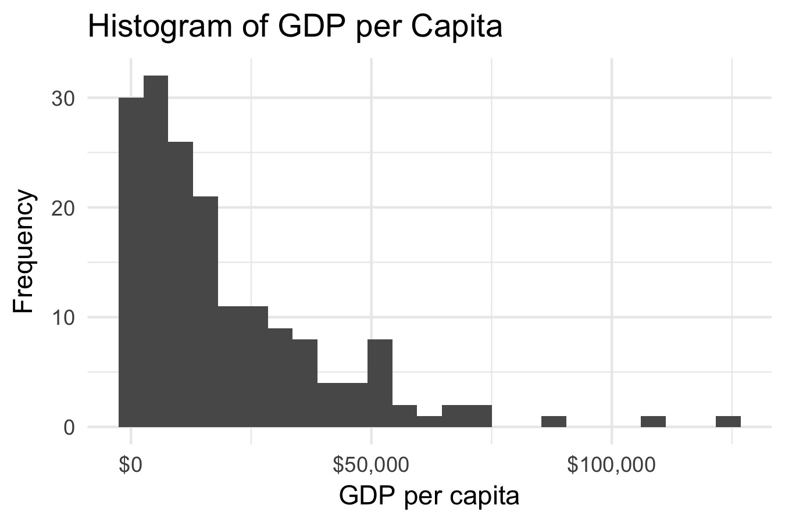

As expected, the histogram of **GDP per Capita** shows a long right tail. We will now transform this to its *log* scale and display the scatter plot again.

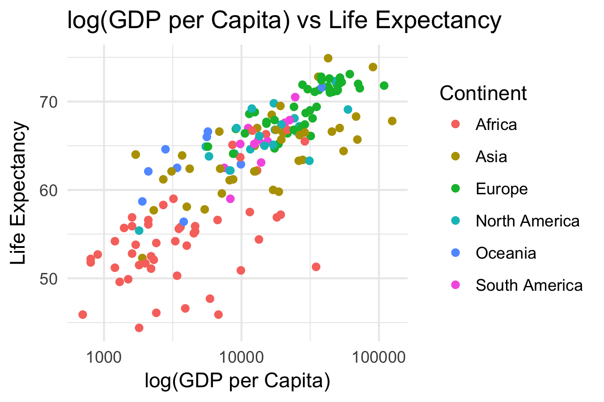

This provides a much cleaner and straighter scatter plot distribution for the two variables, which is why we will be using the *log* scale for **GDP per Capita** in our regression model.

#### Mortality Rate

Next, we will explore the relationship displayed between the **Mortality rate** and **Life Expectancy** through a scatter plot.

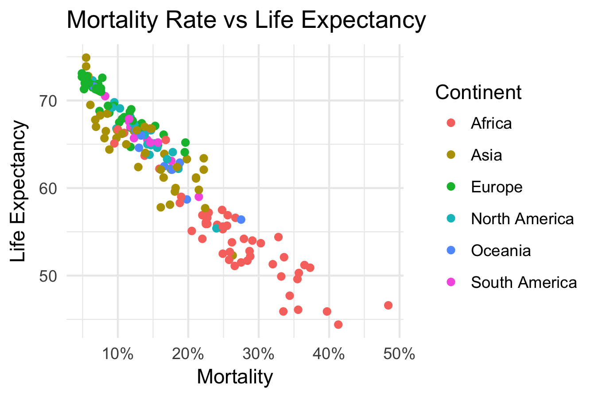

As we can see, there is a strong relationship between the **Mortality rate** and **Life Expectancy** for a given country.

#### Body Mass Index (BMI)

In this section, we will explore the relationship prevalent between **BMI** and **Life Expectancy**. The **BMI** is an attempt to quantify the amount of tissue mass (muscle, fat, and bone) present in the body of an individual. Using this, we can categorize them as *under-weight*, *normal*, *over-weight*, or *obese*.

Following is the scatter plot:

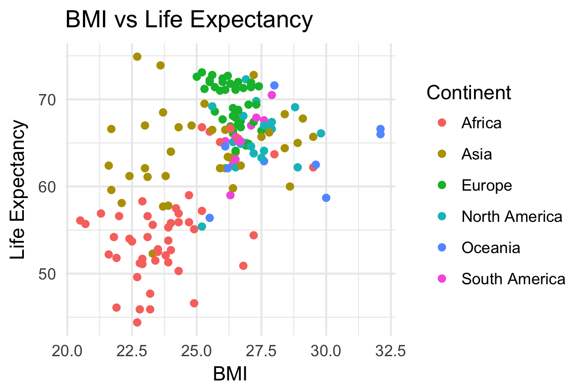

We can see that the **Continent** plays a determining role in the scatter plot. This scatter plot also shows that the values for **BMI** fan out as the **Life Expectancy** increases. We can explore this further by checking the histogram distribution of **BMI**.

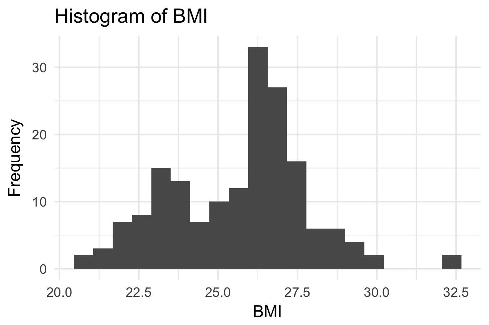

We can see that **BMI** does not have a long right tail, nor is it a monetary value, which is why there should be no need to use the *log* scale for this.

#### Suicide Rate

We will now explore the relationship that exists between **Suicide Rate** and **Life Expectancy** through a scatter plot.

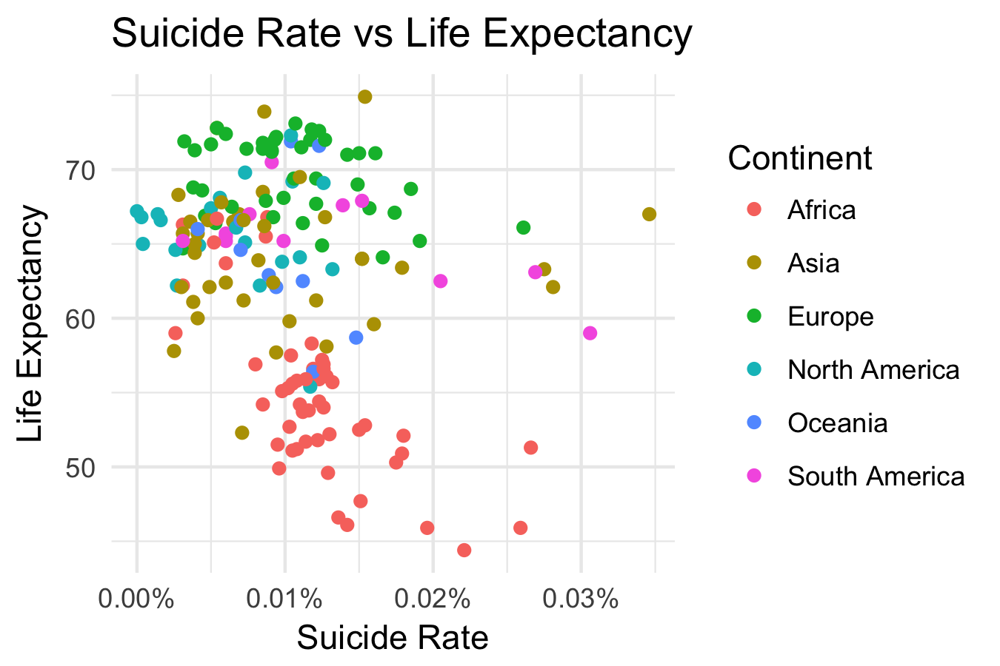

Its hard to find a distinct pattern in this scatter plot, but we can see that **Continent** plays a determining role in the **Suicide Rate**.

#### Child Mortality

Lastly, we will now explore the relationship between **Child Mortality Rate** and **Life Expectancy**.

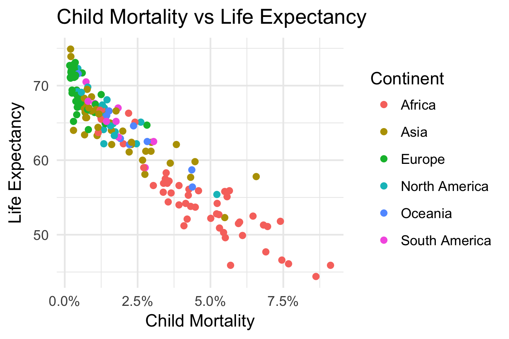

We can see a strong relationship between **Child Mortality** and **Life Expectancy**.

Regression Model
----------------

Now that we know what sort of a relationship is prevalent in the data between the predictors and the response variables individually, we can now begin the process of model creation.

Since we have more than one variable, we will begin by creating a multiple regression model. The model takes the following form:

*y**i* = *β*0 + *β*1 \* *l**o**g*(*G**D**P*)*i* + *β*2 \* *B**M**I**i* + *β*3 \* *C**h**i**l**d**M**o**r**t**a**l**i**t**y**i* + *β*4 \* *M**o**r**t**a**l**i**t**y**i* + *β*5 \* *C**o**n**t**i**n**e**n**t**i* + *β*6 \* *S**u**i**c**i**d**e**R**a**t**e**i* + *ϵ**i*

Model 1
-------

    ## 
    ## Call:
    ## lm(formula = Life_Expectancy ~ ., data = data.new)
    ## 
    ## Residuals:
    ##     Min      1Q  Median      3Q     Max 
    ## -5.2521 -0.6437 -0.0543  0.6420  4.4617 
    ## 
    ## Coefficients: (1 not defined because of singularities)
    ##                             Estimate Std. Error t value    Pr(>|t|)    
    ## (Intercept)                 69.90107    1.90873  36.622     < 2e-16 ***
    ## `log(GDP)`                   0.73829    0.13740   5.373 0.000000265 ***
    ## BMI                         -0.14244    0.06692  -2.129     0.03479 *  
    ## Child_Mortality           -117.61260   10.59815 -11.097     < 2e-16 ***
    ## Mortality                  -41.58397    2.60559 -15.960     < 2e-16 ***
    ## Continent.Africa            -1.53720    0.47515  -3.235     0.00147 ** 
    ## Continent.Asia              -1.07563    0.42130  -2.553     0.01160 *  
    ## Continent.Europe             0.26467    0.41459   0.638     0.52412    
    ## `Continent.North America`    0.14403    0.45578   0.316     0.75240    
    ## Continent.Oceania            0.82553    0.54744   1.508     0.13350    
    ## `Continent.South America`         NA         NA      NA          NA    
    ## Suicide_rate               773.98507 1948.94286   0.397     0.69179    
    ## ---
    ## Signif. codes:  0 '***' 0.001 '**' 0.01 '*' 0.05 '.' 0.1 ' ' 1
    ## 
    ## Residual standard error: 1.214 on 162 degrees of freedom
    ##   (1 observation deleted due to missingness)
    ## Multiple R-squared:  0.9719, Adjusted R-squared:  0.9702 
    ## F-statistic: 560.8 on 10 and 162 DF,  p-value: < 2.2e-16

This model gives us the following equation:

*L**i**f**e**E**x**p**e**c**t**a**n**c**y* = 69.90 + 0.738 \* *l**o**g*(*G**D**P*)−0.1424 \* *B**M**I* − 117.61 \* *C**h**i**l**d**M**o**r**t**a**l**i**t**y* − 41.584 \* *M**o**r**t**a**l**i**t**y* − 1.07 \* *A**s**i**a* + 0.26 \* *E**u**r**o**p**e* + 0.144 \* *N**o**r**t**h**A**m**e**r**i**c**a* + 0.82 \* *O**c**e**a**n**i**a* − 1.54 \* *A**f**r**i**c**a* + 773.98 \* *S**u**i**c**i**d**e**R**a**t**e*

The regression is extremely strong in our case, with an *R*2 of 97.2% and *F* statistic of 560.8. Next we will interpret the meaning of the coefficients in the model.

#### Meaning of Coefficients in the regression model

-   The **intercept** in this equation means that for any South American country with *log*(GDP per Capita of 0), ie. GDP per Capita = 1, Child Mortality = 0%, Mortality = 0%, Suicide rate = 0%, and BMI = 0, the Life Expectancy would be close to 69.9. It has a *p*-value close to 0, which means it is statistically significant.

-   **log(GDP)** in this equation shows that with an increase in GDP per Capita by 1%, the impact on Life Expectancy would be close to 3.05%.

-   **BMI** shows that an increase in BMI score by 1 would result in decrease of Life Expectancy by 0.1424 years and vice-versa.

-   **Child Mortality** shows that an increase in the percentage of Child Mortality rate by 1 would result in a corresponding decrease in Life Expectancy by 1.176 years.

-   **Mortality** shows that a increase in the percentage of Mortality rate by 1 would result in a decrease in Life Expectancy by 0.416 years.

-   **Asia** shows that if the country is in Asia, then the Life Expectancy would fall by 1.07 years.

-   **Europe** shows that if the country is in Europe, the Life Expectancy would increase by 0.26 years.

-   **North America** shows that if the country is in North America, the Life Expectancy would increase by 0.14 years.

-   **Oceania** shows that if the country is in Oceania, the Life Expectancy would increase by 0.82 years.

-   **South America** is NA because it's value is being represented through the intercept, that is when all other predictors are 0.

-   **Africa** shows that if the country is in Africa, then the Life Expectancy would fall by 1.54 years.

-   **Suicide Rate** shows that if the percentage of suicide rate increases by 1, the Life Expectancy would increase by 7.74 years.

Regression Diagnostics
----------------------

We will now begin the diagnosis of our regression model.

-   We will first begin by examining those conditions that can cause an outright numeric error, which may cause an unstable system of equations. **Multicolinearity** is one such issue.

-   Next, we will explore whether our output reflects most of what the data has to offer, or whether its being influenced by a small number of data points. We will check this by examining the presence of *outliers* and *leverage points*.

#### Multicolinearily

We will now explore the Multicollinearity present in the model.

Following is the correlation matrix for the variables in the model.

    ##                 Life_Expectancy Mortality      GDP      BMI Suicide_rate
    ## Life_Expectancy         1.00000  -0.95452  0.63405  0.54671     -0.30306
    ## Mortality              -0.95452   1.00000 -0.60852 -0.49981      0.40060
    ## GDP                     0.63405  -0.60852  1.00000  0.34834     -0.09725
    ## BMI                     0.54671  -0.49981  0.34834  1.00000     -0.27560
    ## Suicide_rate           -0.30306   0.40060 -0.09725 -0.27560      1.00000
    ## Child_Mortality        -0.93934   0.86988 -0.57290 -0.55653      0.23684
    ##                 Child_Mortality
    ## Life_Expectancy        -0.93934
    ## Mortality               0.86988
    ## GDP                    -0.57290
    ## BMI                    -0.55653
    ## Suicide_rate            0.23684
    ## Child_Mortality         1.00000

In this, we can see that **Mortality** and **Child Mortality** have an extremely high correlation of 86.99% with each other. **Mortality** has a high correlation of -95.45% with **Life Expectancy** while **Child Mortality** has a lower correlation of -93.93%.

We will further explore the VIF scores of each of these variables.

    ##                     GVIF Df GVIF^(1/(2*Df))
    ## Mortality       6.338333  1        2.517605
    ## GDP             1.873471  1        1.368748
    ## BMI             2.155576  1        1.468188
    ## Suicide_rate    1.562485  1        1.249994
    ## Child_Mortality 5.303077  1        2.302841
    ## Continent       4.469896  5        1.161528

We can see that the GVIF scores for all variables are well below the danger territory which was max{$10,\\frac{1}{1-R^2\_{Model}}$}, which in our case would be max{10, 35.6}. This indicates that although there is high correlation between the predictors, they are more correlated to the response variable than they are to each other. Having said that, I will leave them in the model for now.

#### Residuals, Leverage, and Cooks Distance

##### Residuals

We will first begin by studying the Standardized Residuals in the model.

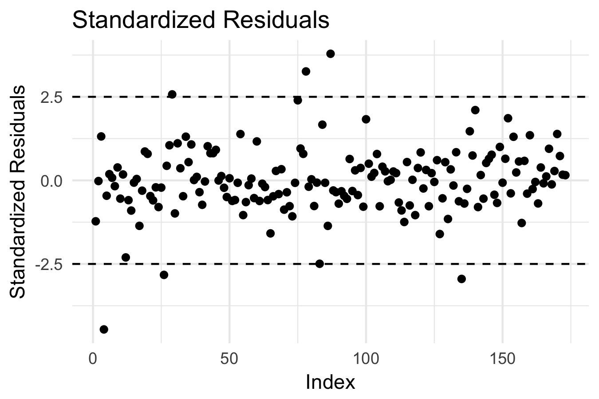

We can see that there are around 9 points with high standardized residuals with index numbers 4, 12, 26, 29, 75, 78, 83, 87 and 135.

Following is the data for them:

*Outliers*

    ##                      Country Life_Expectancy Mortality   GDP  BMI
    ## 4                     Angola            45.9     0.335  6800 23.2
    ## 12                   Bahrain            67.0     0.069 51800 24.8
    ## 26                  Cambodia            58.1     0.174  4000 22.1
    ## 29  Central African Republic            45.9     0.397   700 22.8
    ## 75                    Israel            72.8     0.058 36200 27.2
    ## 78                     Japan            74.9     0.055 42700 22.7
    ## 83                    Kuwait            65.7     0.081 69700 29.5
    ## 87                   Lesotho            46.6     0.484  3900 24.9
    ## 135             Saudi Arabia            64.4     0.088 55300 28.4
    ##     Suicide_rate Child_Mortality Continent
    ## 4       0.000259          0.0569    Africa
    ## 12      0.000069          0.0066      Asia
    ## 26      0.000128          0.0275      Asia
    ## 29      0.000196          0.0912    Africa
    ## 75      0.000054          0.0030      Asia
    ## 78      0.000154          0.0020      Asia
    ## 83      0.000041          0.0075      Asia
    ## 87      0.000136          0.0745    Africa
    ## 135     0.000039          0.0114      Asia

To give an idea of their distribution, the points in **dark blue** are the outliers in the following graph. They may not necessarily look like outliers as I will only display them in one scatter plot which may not be representative of those predictor variables that make them an outlier.

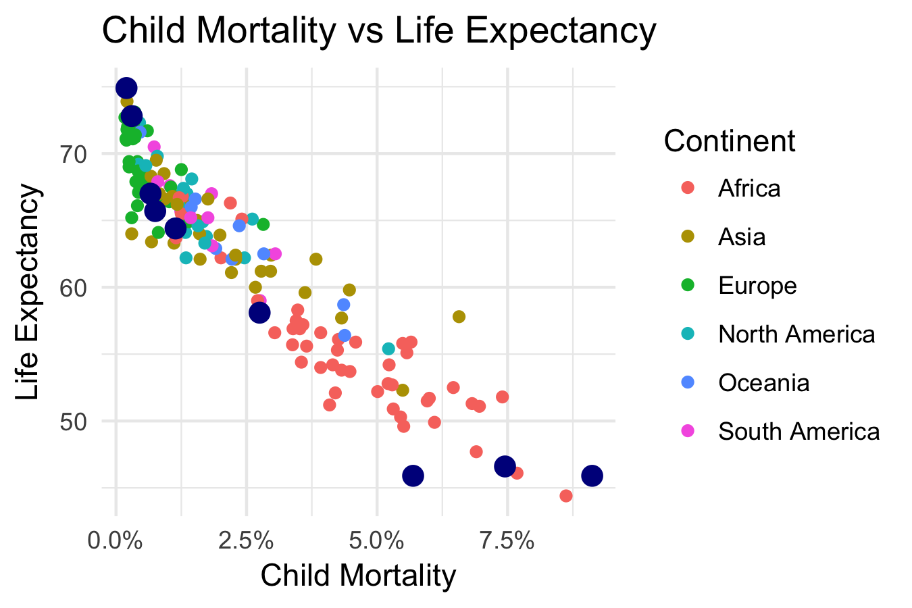

##### Leverage

Now we will study the leverage points within our model.

The average leverage in the model should be close to $(\\frac{p + 1}{n})$ where *p* is the number of predictors and *n* is the number of rows. Having said that, the average leverage would be close to 0.0636. We know a point has high leverage when the leverage value is 2.5\*$(\\frac{p + 1}{n})$ which, in our case, would be greater than .1589

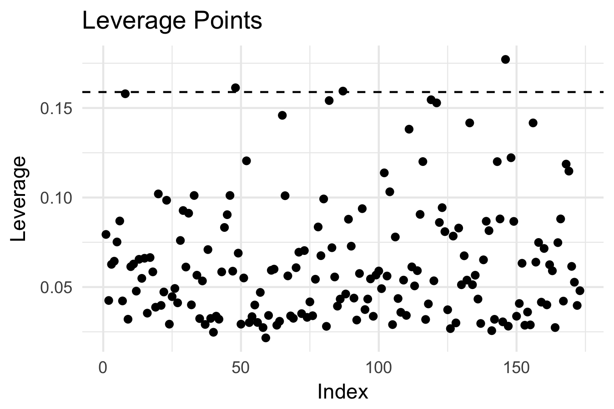

The points that lie above the .1589 line are the following index values: 8, 48, 82, 87, 119, 121, 146

Following are the high leverage points:

*Leverage Points*

    ##               Country Life_Expectancy Mortality   GDP  BMI Suicide_rate
    ## 87            Lesotho            46.6     0.484  3900 24.9     0.000136
    ## 82           Kiribati            58.7     0.198  1900 30.0     0.000148
    ## 119          Pakistan            57.8     0.161  5400 23.9     0.000025
    ## 121  Papua New Guinea            56.4     0.275  3800 25.5     0.000119
    ## 146             Spain            72.4     0.056 38200 26.0     0.000060
    ## 48  Equatorial Guinea            51.3     0.320 34900 23.9     0.000266
    ## 8           Australia            71.9     0.059 49900 27.1     0.000104
    ##     Child_Mortality Continent
    ## 87           0.0745    Africa
    ## 82           0.0436   Oceania
    ## 119          0.0657      Asia
    ## 121          0.0438   Oceania
    ## 146          0.0028    Europe
    ## 48           0.0682    Africa
    ## 8            0.0032   Oceania

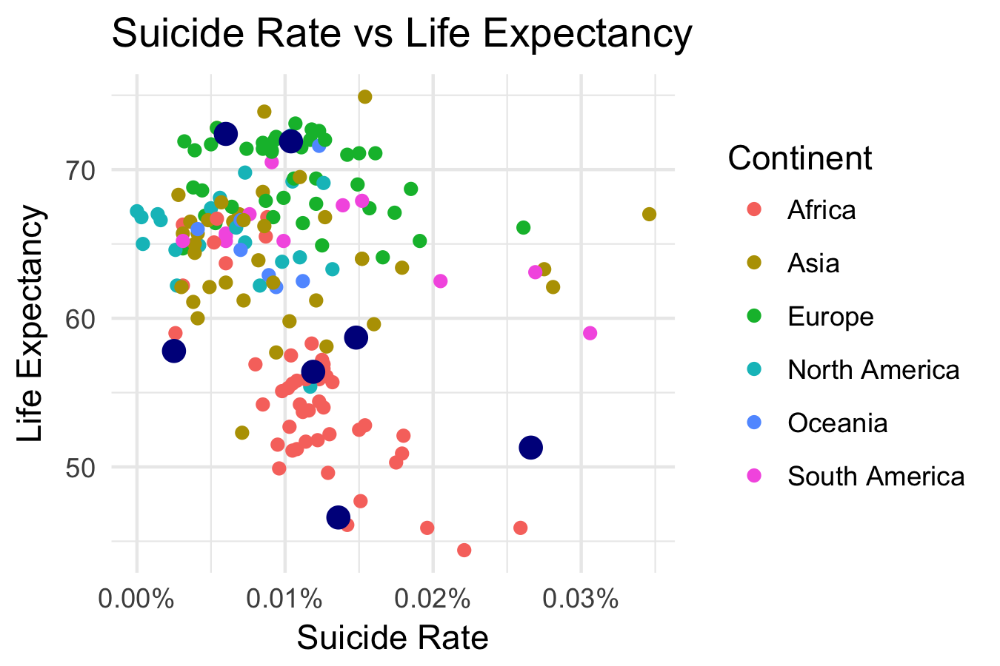

##### Cook's Distance

At last, we will explore the Cook's Distance for the model. We know that the Cook's Distance (Denoted by *D**i*) is an appealing way of combining the notions of Outlyingness and Leverage.

Following is the formula for Cook's Distance:

$$D\_{i} = \\frac{(e^\*\_{i})h\_{ii}}{(p+1)(1-h\_{ii})}$$
 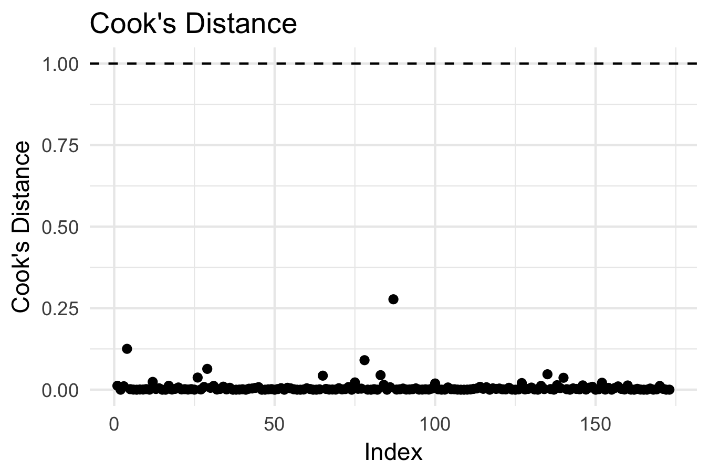

Since in this case, all the points show a Cook's Distance of less than 1, we will not remove any points on the basis of their Cook's Distance.

Model 2
-------

Before anything else, we will first begin by filtering the data so as to remove the outlying points and those that had high leverage over the model.

Our filtered data now has 160 rows. We will now create a new model with these points.

    ## 
    ## Call:
    ## lm(formula = Life_Expectancy ~ ., data = data.new)
    ## 
    ## Residuals:
    ##      Min       1Q   Median       3Q      Max 
    ## -2.27477 -0.59281 -0.04575  0.49323  2.13734 
    ## 
    ## Coefficients: (1 not defined because of singularities)
    ##                            Estimate Std. Error t value Pr(>|t|)    
    ## (Intercept)                 69.6376     1.4975  46.501  < 2e-16 ***
    ## `log(GDP)`                   0.7548     0.1074   7.026 7.21e-11 ***
    ## BMI                         -0.1317     0.0533  -2.472 0.014588 *  
    ## Child_Mortality           -118.3251     8.5283 -13.874  < 2e-16 ***
    ## Continent.Africa            -1.2549     0.3556  -3.529 0.000556 ***
    ## Continent.Asia              -0.8431     0.3148  -2.679 0.008229 ** 
    ## Continent.Europe             0.1510     0.3056   0.494 0.621940    
    ## `Continent.North America`    0.2031     0.3332   0.609 0.543182    
    ## Continent.Oceania            0.9442     0.4500   2.098 0.037591 *  
    ## `Continent.South America`        NA         NA      NA       NA    
    ## Mortality                  -43.7870     2.0848 -21.003  < 2e-16 ***
    ## Suicide_rate              1909.5562  1488.6488   1.283 0.201587    
    ## ---
    ## Signif. codes:  0 '***' 0.001 '**' 0.01 '*' 0.05 '.' 0.1 ' ' 1
    ## 
    ## Residual standard error: 0.884 on 148 degrees of freedom
    ##   (1 observation deleted due to missingness)
    ## Multiple R-squared:  0.9837, Adjusted R-squared:  0.9826 
    ## F-statistic: 892.9 on 10 and 148 DF,  p-value: < 2.2e-16

This model gives us a higher value for both, the *R*2: 98.37% and the *F*-statistic: 892.9.

We now get the following regression equation:

*L**i**f**e**E**x**p**e**c**t**a**n**c**y* = 69.63 + 0.755 \* *l**o**g*(*G**D**P*)−0.1317 \* *B**M**I* − 118.32 \* *C**h**i**l**d**M**o**r**t**a**l**i**t**y* − 43.79 \* *M**o**r**t**a**l**i**t**y* − 0.84 \* *A**s**i**a* + 0.15 \* *E**u**r**o**p**e* + 0.203 \* *N**o**r**t**h**A**m**e**r**i**c**a* + 0.944 \* *O**c**e**a**n**i**a* − 1.25 \* *A**f**r**i**c**a* + 1909.55 \* *S**u**i**c**i**d**e**R**a**t**e*

The interpretations for these coefficients remain similar to the previous, with a change in magnitude of impact for each.

Regression Diagnostics
----------------------

#### Multicolinearily

We will now explore the Multicollinearity present in the model.

Following is the correlation matrix for the variables in the model.

    ##                 Life_Expectancy Mortality      GDP      BMI Suicide_rate
    ## Life_Expectancy         1.00000  -0.96051  0.63202  0.58043     -0.26159
    ## Mortality              -0.96051   1.00000 -0.59797 -0.53013      0.36706
    ## GDP                     0.63202  -0.59797  1.00000  0.33786     -0.04855
    ## BMI                     0.58043  -0.53013  0.33786  1.00000     -0.25354
    ## Suicide_rate           -0.26159   0.36706 -0.04855 -0.25354      1.00000
    ## Child_Mortality        -0.94321   0.86540 -0.55858 -0.59049      0.19710
    ##                 Child_Mortality
    ## Life_Expectancy        -0.94321
    ## Mortality               0.86540
    ## GDP                    -0.55858
    ## BMI                    -0.59049
    ## Suicide_rate            0.19710
    ## Child_Mortality         1.00000

In this, we can see that **Mortality** and **Child Mortality** have a similar high correlation of 86.54% with each other as in the previous model. **Mortality** has a high correlation of -96.1% with **Life Expectancy** while **Child Mortality** has a lower correlation of -94.32%.

We will further explore the VIF scores of each of these variables.

    ##                     GVIF Df GVIF^(1/(2*Df))
    ## Mortality       6.102421  1        2.470308
    ## GDP             1.850074  1        1.360174
    ## BMI             2.243047  1        1.497680
    ## Suicide_rate    1.548275  1        1.244297
    ## Child_Mortality 5.331280  1        2.308957
    ## Continent       4.835290  5        1.170691

We can see that the GVIF scores for all variables are again well below the danger territory which in our case would be max{10, 61.65}. This indicates that although there is high correlation between the predictors, they are more correlated to the response variable than they are to each other. Having said that, I will leave them in the model for now.

We can make an inference that Multicollinearity won't play any major part in impacting the regression model that we created. For that reason, we won't examine for Multicollinearity any further.

#### Residuals, Leverage, and Cooks Distance

##### Residuals

We will first begin by studying the Standardized Residuals in the model.

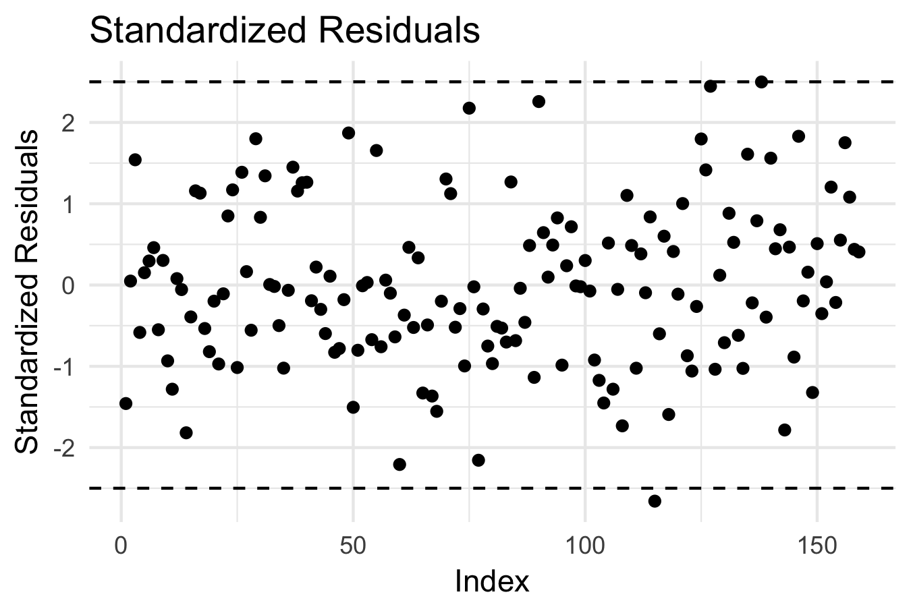

We can see that there are around 2 points with high standardized residuals with index numbers 115 and 138.

Following is the data for them:

*Outliers*

    ##         Country Life_Expectancy Mortality   GDP  BMI Suicide_rate
    ## 115 North Korea            64.0     0.139  1700 24.0     0.000152
    ## 138  Seychelles            65.5     0.168 28900 26.6     0.000087
    ##     Child_Mortality Continent
    ## 115          0.0160      Asia
    ## 138          0.0125    Africa

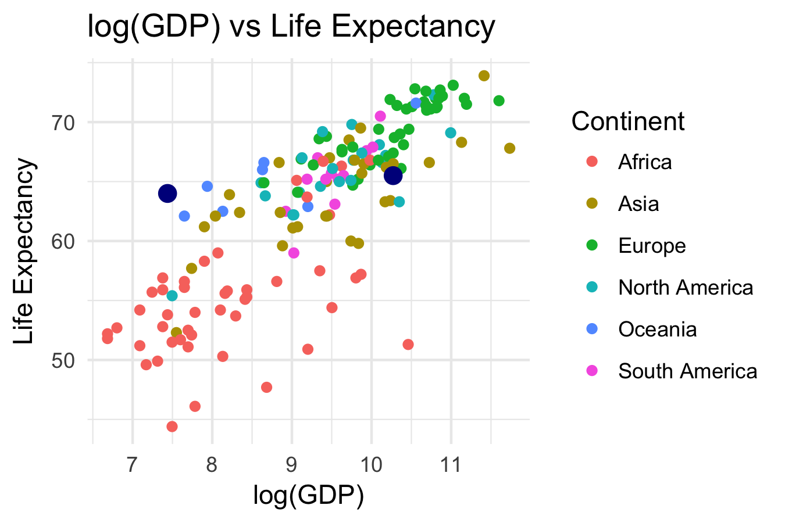

##### Leverage

Checing for leverage points.

The average leverage would be close to 0.0692. We know a point has high leverage when the leverage value is 2.5\*$(\\frac{p + 1}{n})$ which, in our case, would be greater than 0.1725

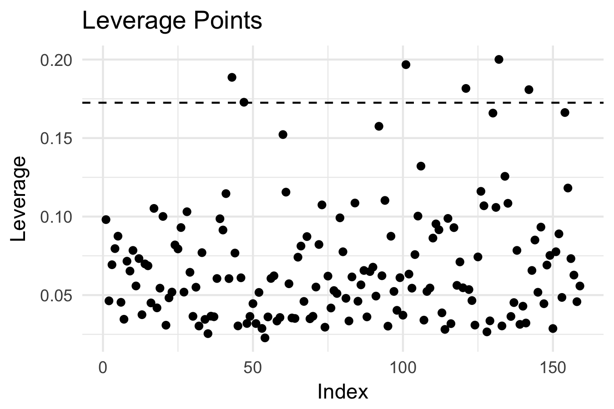

The points that lie above the 0.1725 line are the following index values: 43, 47, 101, 121, 132, 142

Following are the high leverage points:

*Leverage Points*

    ##                              Country Life_Expectancy Mortality   GDP  BMI
    ## 43                Dominican Republic            65.1     0.152 17000 26.4
    ## 47                       El Salvador            64.1     0.178  8900 27.6
    ## 101                           Mexico            67.4     0.122 19500 27.9
    ## 121                 Papua New Guinea            56.4     0.275  3800 25.5
    ## 132 Saint Vincent and the Grenadines            64.6     0.156 11600 27.1
    ## 142                         Slovenia            71.1     0.074 34100 26.5
    ##     Suicide_rate Child_Mortality     Continent
    ## 43      0.000073          0.0261 North America
    ## 47      0.000110          0.0133 North America
    ## 101     0.000050          0.0129 North America
    ## 121     0.000119          0.0438       Oceania
    ## 132     0.000026          0.0157 North America
    ## 142     0.000150          0.0019        Europe

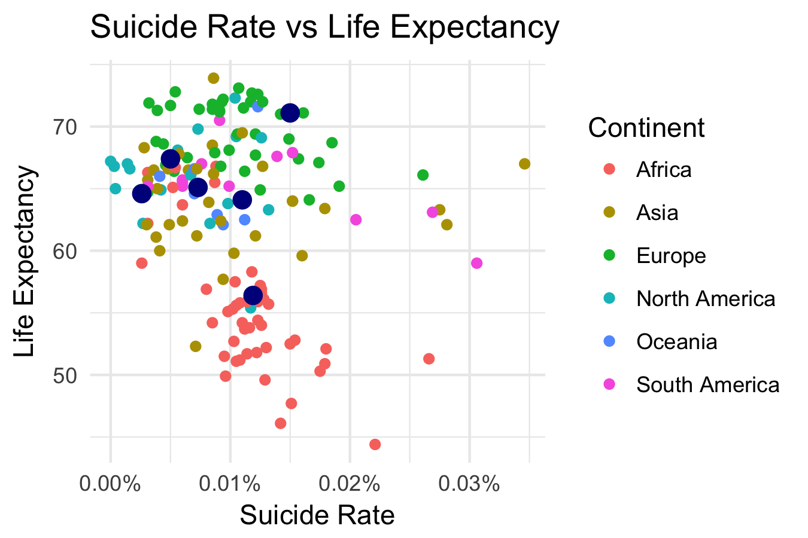

##### Cook's Distance

At last, we will explore the Cook's Distance for the new model. We know that the Cook's Distance (Denoted by *D**i*) is an appealing way of combining the notions of Outlyingness and Leverage.

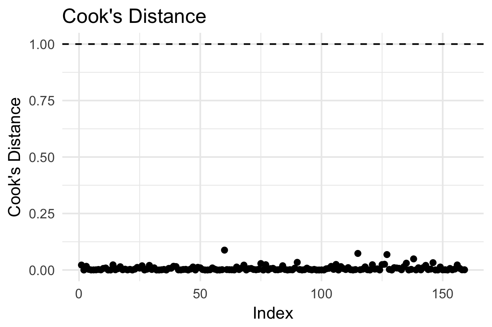

This is good news, as there are again no points with high Cook's Distance.

We will can now re-filter the data and begin with Residual Analysis and Model Selection.

Model 3
-------

Our filtered data now has 152 rows. We will now create a new model with these points.

    ## 
    ## Call:
    ## lm(formula = Life_Expectancy ~ ., data = data.new)
    ## 
    ## Residuals:
    ##      Min       1Q   Median       3Q      Max 
    ## -2.18095 -0.58070 -0.06016  0.47502  2.14781 
    ## 
    ## Coefficients: (1 not defined because of singularities)
    ##                             Estimate Std. Error t value     Pr(>|t|)    
    ## (Intercept)                 70.20554    1.55436  45.167      < 2e-16 ***
    ## `log(GDP)`                   0.69932    0.11746   5.953 0.0000000201 ***
    ## BMI                         -0.13298    0.05371  -2.476     0.014474 *  
    ## Child_Mortality           -119.48979    8.89372 -13.435      < 2e-16 ***
    ## Continent.Africa            -1.31792    0.36310  -3.630     0.000397 ***
    ## Continent.Asia              -0.81366    0.32104  -2.534     0.012362 *  
    ## Continent.Europe             0.17801    0.30797   0.578     0.564187    
    ## `Continent.North America`    0.12076    0.34743   0.348     0.728668    
    ## Continent.Oceania            0.91128    0.45232   2.015     0.045852 *  
    ## `Continent.South America`         NA         NA      NA           NA    
    ## Mortality                  -43.88539    2.11955 -20.705      < 2e-16 ***
    ## Suicide_rate              2114.70591 1537.30906   1.376     0.171146    
    ## ---
    ## Signif. codes:  0 '***' 0.001 '**' 0.01 '*' 0.05 '.' 0.1 ' ' 1
    ## 
    ## Residual standard error: 0.8867 on 140 degrees of freedom
    ##   (1 observation deleted due to missingness)
    ## Multiple R-squared:  0.9843, Adjusted R-squared:  0.9832 
    ## F-statistic: 876.3 on 10 and 140 DF,  p-value: < 2.2e-16

This model gives us a higher value for *R*2: 98.43% but a lower value for the *F*-statistic: 876.3.

We now get the following regression equation:

*L**i**f**e**E**x**p**e**c**t**a**n**c**y* = 70.20 + 0.699 \* *l**o**g*(*G**D**P*)−0.132 \* *B**M**I* − 119.48 \* *C**h**i**l**d**M**o**r**t**a**l**i**t**y* − 43.88 \* *M**o**r**t**a**l**i**t**y* − 0.81 \* *A**s**i**a* + 0.178 \* *E**u**r**o**p**e* + 0.120 \* *N**o**r**t**h**A**m**e**r**i**c**a* + 0.911 \* *O**c**e**a**n**i**a* − 1.318 \* *A**f**r**i**c**a* + 2114.7 \* *S**u**i**c**i**d**e**R**a**t**e*

As we can see, the *p*-value of Suicide Rate, North America, and Europe are high. For that reason I will remove these predictors and re-create a new model. I will then compare the new model with this current model (model 3).

Model 4
-------

    ## 
    ## Call:
    ## lm(formula = Life_Expectancy ~ 1 + `log(GDP)` + BMI + Child_Mortality + 
    ##     Continent.Africa + Continent.Asia + Continent.Oceania + Mortality + 
    ##     `Continent.South America`, data = data.new)
    ## 
    ## Residuals:
    ##      Min       1Q   Median       3Q      Max 
    ## -2.21376 -0.65592 -0.01527  0.51059  2.08497 
    ## 
    ## Coefficients:
    ##                             Estimate Std. Error t value Pr(>|t|)    
    ## (Intercept)                 70.46780    1.51470  46.523  < 2e-16 ***
    ## `log(GDP)`                   0.76103    0.10935   6.960 1.16e-10 ***
    ## BMI                         -0.15803    0.05001  -3.160  0.00193 ** 
    ## Child_Mortality           -121.14730    8.82372 -13.730  < 2e-16 ***
    ## Continent.Africa            -1.53600    0.29212  -5.258 5.24e-07 ***
    ## Continent.Asia              -1.00299    0.21647  -4.633 8.06e-06 ***
    ## Continent.Oceania            0.84472    0.40593   2.081  0.03924 *  
    ## Mortality                  -42.45300    1.82617 -23.247  < 2e-16 ***
    ## `Continent.South America`   -0.08449    0.28813  -0.293  0.76977    
    ## ---
    ## Signif. codes:  0 '***' 0.001 '**' 0.01 '*' 0.05 '.' 0.1 ' ' 1
    ## 
    ## Residual standard error: 0.8872 on 142 degrees of freedom
    ##   (1 observation deleted due to missingness)
    ## Multiple R-squared:  0.984,  Adjusted R-squared:  0.9831 
    ## F-statistic:  1094 on 8 and 142 DF,  p-value: < 2.2e-16

This model gives us a similar value for *R*2: 98.4% but much higher *F*-statistic: 1094

We now get the following regression equation:

*L**i**f**e**E**x**p**e**c**t**a**n**c**y* = 70.46 + 0.76 \* *l**o**g*(*G**D**P*)−0.158 \* *B**M**I* − 121.14 \* *C**h**i**l**d**M**o**r**t**a**l**i**t**y* − 42.45 \* *M**o**r**t**a**l**i**t**y* − 1.03 \* *A**s**i**a* + 0.844 \* *O**c**e**a**n**i**a* − 1.53 \* *A**f**r**i**c**a* − 0.0845 \* *S**o**u**t**h**A**m**e**r**i**c**a*

We can see however that the *p*-values for South America, Oceania, and BMI are high. For that reason, I will remove them from the model and re-create a newer one.

Model 5
=======

    ## 
    ## Call:
    ## lm(formula = Life_Expectancy ~ 1 + `log(GDP)` + Child_Mortality + 
    ##     Continent.Africa + Continent.Asia + Mortality, data = data.new)
    ## 
    ## Residuals:
    ##      Min       1Q   Median       3Q      Max 
    ## -2.55130 -0.60413  0.00498  0.56217  2.56886 
    ## 
    ## Coefficients:
    ##                   Estimate Std. Error t value      Pr(>|t|)    
    ## (Intercept)        67.5470     1.1133  60.671       < 2e-16 ***
    ## `log(GDP)`          0.6357     0.1036   6.134 0.00000000775 ***
    ## Child_Mortality  -118.1231     9.0036 -13.120       < 2e-16 ***
    ## Continent.Africa   -1.3521     0.2720  -4.971 0.00000185060 ***
    ## Continent.Asia     -0.8600     0.2044  -4.207 0.00004510423 ***
    ## Mortality         -42.9685     1.8697 -22.981       < 2e-16 ***
    ## ---
    ## Signif. codes:  0 '***' 0.001 '**' 0.01 '*' 0.05 '.' 0.1 ' ' 1
    ## 
    ## Residual standard error: 0.9126 on 145 degrees of freedom
    ## Multiple R-squared:  0.9827, Adjusted R-squared:  0.9822 
    ## F-statistic:  1652 on 5 and 145 DF,  p-value: < 2.2e-16

#### Partial F-test for Model 4 and Model 5

We will now construct a partial *F* test for model 4 and model 4 to check whether our simpler model (model 5) is better than the one which is more complicated (model 4).

    ## Analysis of Variance Table
    ## 
    ## Model 1: Life_Expectancy ~ 1 + `log(GDP)` + Child_Mortality + Continent.Africa + 
    ##     Continent.Asia + Mortality
    ## Model 2: Life_Expectancy ~ 1 + `log(GDP)` + BMI + Child_Mortality + Continent.Africa + 
    ##     Continent.Asia + Continent.Oceania + Mortality + `Continent.South America`
    ##   Res.Df    RSS Df Sum of Sq     F  Pr(>F)  
    ## 1    145 120.77                             
    ## 2    142 111.78  3    8.9948 3.809 0.01157 *
    ## ---
    ## Signif. codes:  0 '***' 0.001 '**' 0.01 '*' 0.05 '.' 0.1 ' ' 1

The *F*-statistic of the test is 3.1074 and the tail probability is 0.02864. This indicates that our simpler model is statistically different from the previous model. With an *R*2 of 98.27% and an *F*-statistic of 1951, our newer model is much simpler without losing much of *R*2.

#### Residual Plot

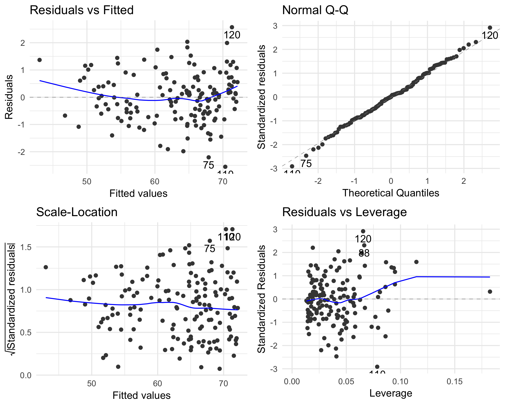

We can now see that there are 3 other points that may potentially influence the regression model - 110, 120, 88

Following are the rows:

    ##       Country Life_Expectancy Mortality    GDP  BMI Suicide_rate
    ## 110     Qatar            67.8     0.068 124900 29.1     0.000057
    ## 120 Singapore            73.9     0.055  90500 23.6     0.000086
    ## 88  Mauritius            66.8     0.146  21600 25.2     0.000088
    ##     Child_Mortality Continent
    ## 110          0.0074      Asia
    ## 120          0.0021      Asia
    ## 88           0.0127    Africa

We will now filter the data accordingly and then re-create the model.

Model 6
-------

After filtering the dataset yet again, our dataset now has 149 rows.

    ## 
    ## Call:
    ## lm(formula = Life_Expectancy ~ 1 + `log(GDP)` + Child_Mortality + 
    ##     Continent.Africa + Continent.Asia + Mortality, data = data.new)
    ## 
    ## Residuals:
    ##      Min       1Q   Median       3Q      Max 
    ## -2.14974 -0.59035  0.04953  0.58501  2.01731 
    ## 
    ## Coefficients:
    ##                   Estimate Std. Error t value      Pr(>|t|)    
    ## (Intercept)        67.4188     1.0579  63.729       < 2e-16 ***
    ## `log(GDP)`          0.6431     0.0991   6.490 0.00000000132 ***
    ## Child_Mortality  -114.3359     8.4698 -13.499       < 2e-16 ***
    ## Continent.Africa   -1.5286     0.2632  -5.809 0.00000003920 ***
    ## Continent.Asia     -0.9015     0.1972  -4.572 0.00001035704 ***
    ## Mortality         -42.8295     1.7469 -24.518       < 2e-16 ***
    ## ---
    ## Signif. codes:  0 '***' 0.001 '**' 0.01 '*' 0.05 '.' 0.1 ' ' 1
    ## 
    ## Residual standard error: 0.8503 on 143 degrees of freedom
    ## Multiple R-squared:  0.9853, Adjusted R-squared:  0.9848 
    ## F-statistic:  1913 on 5 and 143 DF,  p-value: < 2.2e-16

We can see that the *R*2 has increased to 98.53% and the *F*-statistic has also risen to 1913.

Before anything else, we will conduct a quick residual analysis.

#### Residual Analysis

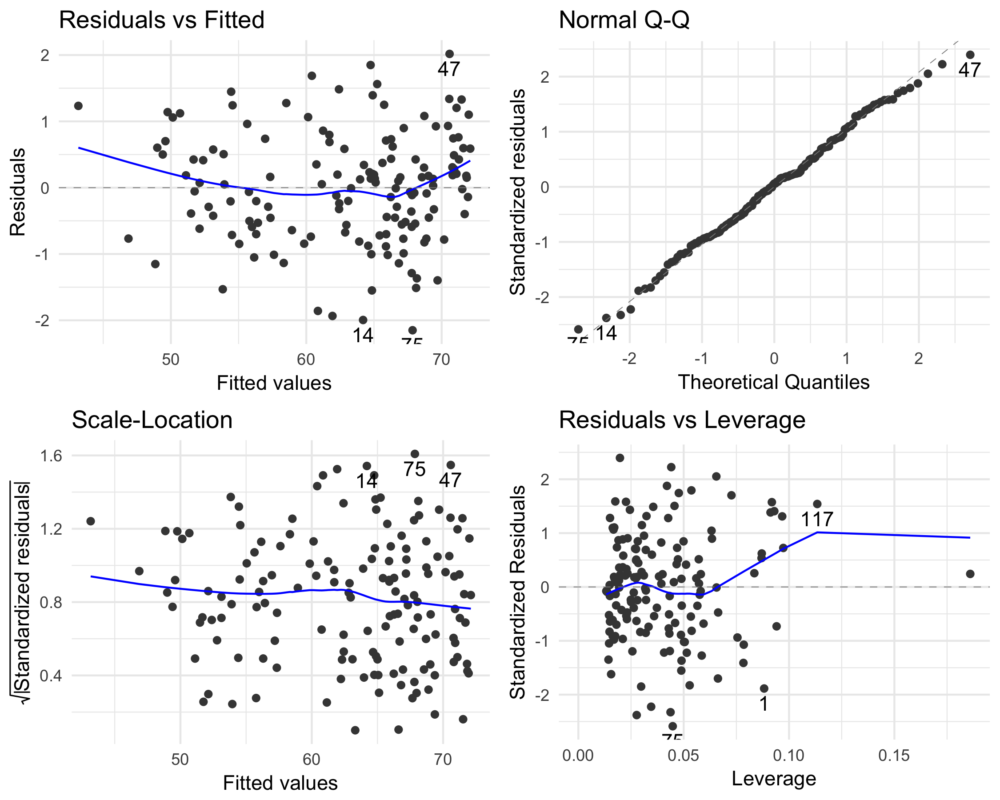

We can now see that there are 3 other points that may potentially influence the regression model - 14, 47, 75

Following are the rows:

    ##    Country Life_Expectancy Mortality   GDP  BMI Suicide_rate
    ## 47  France            72.6     0.078 43600 25.0     0.000123
    ## 75 Lebanon            65.7     0.098 19500 27.5     0.000031
    ## 14  Belize            62.2     0.175  8300 28.9     0.000083
    ##    Child_Mortality     Continent
    ## 47          0.0032        Europe
    ## 75          0.0072          Asia
    ## 14          0.0134 North America

We will now remove them and create our new model.

Model 7
-------

After filtering the dataset yet again, our dataset now has 146 rows.

    ## 
    ## Call:
    ## lm(formula = Life_Expectancy ~ 1 + `log(GDP)` + Child_Mortality + 
    ##     Continent.Africa + Continent.Asia + Mortality, data = data.new)
    ## 
    ## Residuals:
    ##      Min       1Q   Median       3Q      Max 
    ## -1.99306 -0.59597  0.02269  0.55010  1.75476 
    ## 
    ## Coefficients:
    ##                    Estimate Std. Error t value      Pr(>|t|)    
    ## (Intercept)        67.72170    1.00273  67.537       < 2e-16 ***
    ## `log(GDP)`          0.61147    0.09403   6.503 0.00000000130 ***
    ## Child_Mortality  -117.06843    8.03689 -14.566       < 2e-16 ***
    ## Continent.Africa   -1.52975    0.25032  -6.111 0.00000000927 ***
    ## Continent.Asia     -0.82184    0.19020  -4.321 0.00002926411 ***
    ## Mortality         -42.51291    1.65938 -25.620       < 2e-16 ***
    ## ---
    ## Signif. codes:  0 '***' 0.001 '**' 0.01 '*' 0.05 '.' 0.1 ' ' 1
    ## 
    ## Residual standard error: 0.8037 on 140 degrees of freedom
    ## Multiple R-squared:  0.9869, Adjusted R-squared:  0.9865 
    ## F-statistic:  2113 on 5 and 140 DF,  p-value: < 2.2e-16

Our model's *F*-statistic has further increased to 2113 and our *R*2 value is now 98.69%. We will now do a quick residual plot analysis.

#### Residual Plot

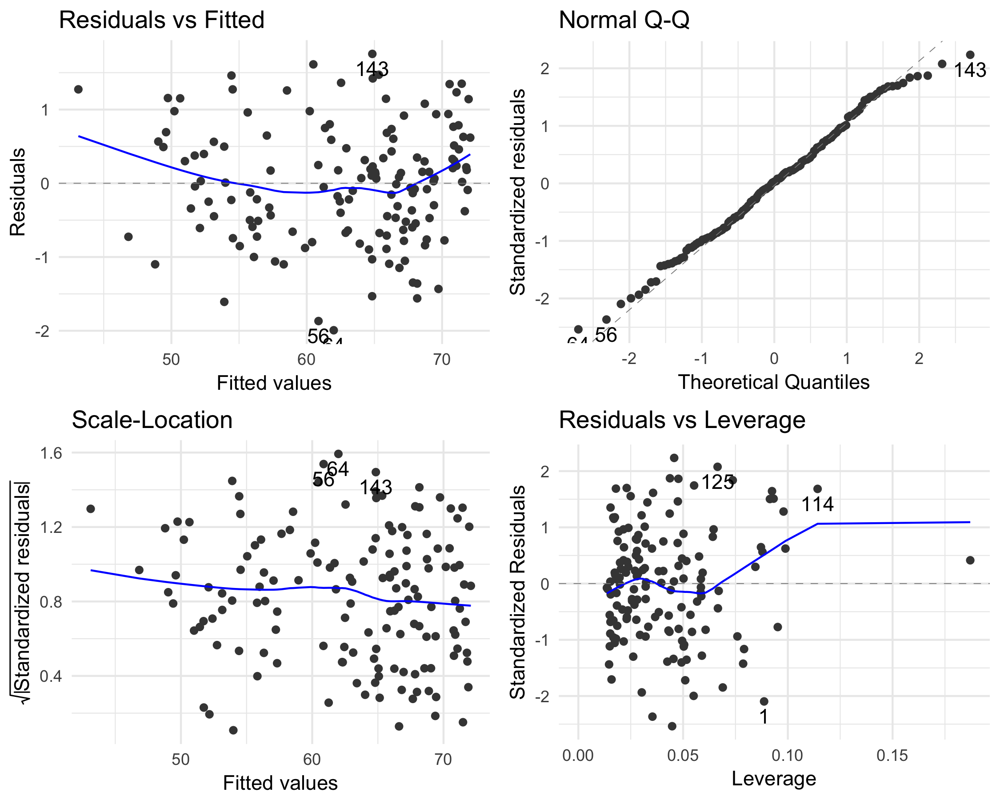

We can now see that there are 2 other points that may potentially influence the regression model - 64, 143

Following are the rows:

    ##     Country Life_Expectancy Mortality   GDP  BMI Suicide_rate
    ## 64     Iraq            60.0     0.182 17000 28.6     0.000041
    ## 143 Vietnam            66.6     0.127  6900 21.7     0.000072
    ##     Child_Mortality Continent
    ## 64           0.0267      Asia
    ## 143          0.0176      Asia

We will now remove them and create our new model.

Model 8
-------

After filtering the dataset yet again, our dataset now has 144 rows.

    ## 
    ## Call:
    ## lm(formula = Life_Expectancy ~ 1 + `log(GDP)` + Continent.Africa + 
    ##     Continent.Asia + Mortality + Child_Mortality, data = data.new)
    ## 
    ## Residuals:
    ##      Min       1Q   Median       3Q      Max 
    ## -1.89196 -0.60305  0.02818  0.51645  1.62416 
    ## 
    ## Coefficients:
    ##                    Estimate Std. Error t value Pr(>|t|)    
    ## (Intercept)        67.32513    0.97600  68.981  < 2e-16 ***
    ## `log(GDP)`          0.64679    0.09146   7.072 6.98e-11 ***
    ## Continent.Africa   -1.56148    0.24211  -6.449 1.76e-09 ***
    ## Continent.Asia     -0.82101    0.18858  -4.354 2.59e-05 ***
    ## Mortality         -42.21773    1.60650 -26.279  < 2e-16 ***
    ## Child_Mortality  -115.68888    7.77877 -14.872  < 2e-16 ***
    ## ---
    ## Signif. codes:  0 '***' 0.001 '**' 0.01 '*' 0.05 '.' 0.1 ' ' 1
    ## 
    ## Residual standard error: 0.7768 on 138 degrees of freedom
    ## Multiple R-squared:  0.9879, Adjusted R-squared:  0.9875 
    ## F-statistic:  2257 on 5 and 138 DF,  p-value: < 2.2e-16

We can now see that our model's *F*-statistic has further increased to 2257 and our *R*2 value is now 98.79%. We will now do a quick residual plot analysis.

##### Residual Analysis

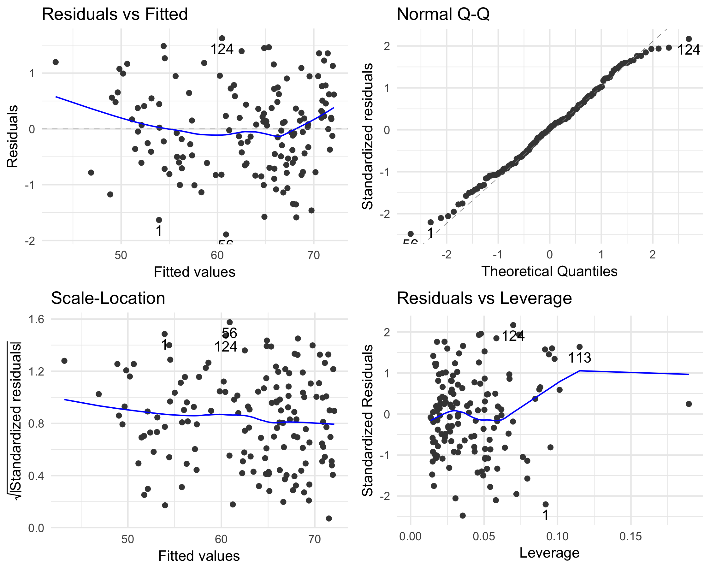

The residuals and leverage points now seem to be in line with the assumptions of our multiple regression model. We will now analyze the histogram of residuals for our model.

###### Histogram of Residuals

Following is a histogram of residuals to check whether they're normally distributed or not.

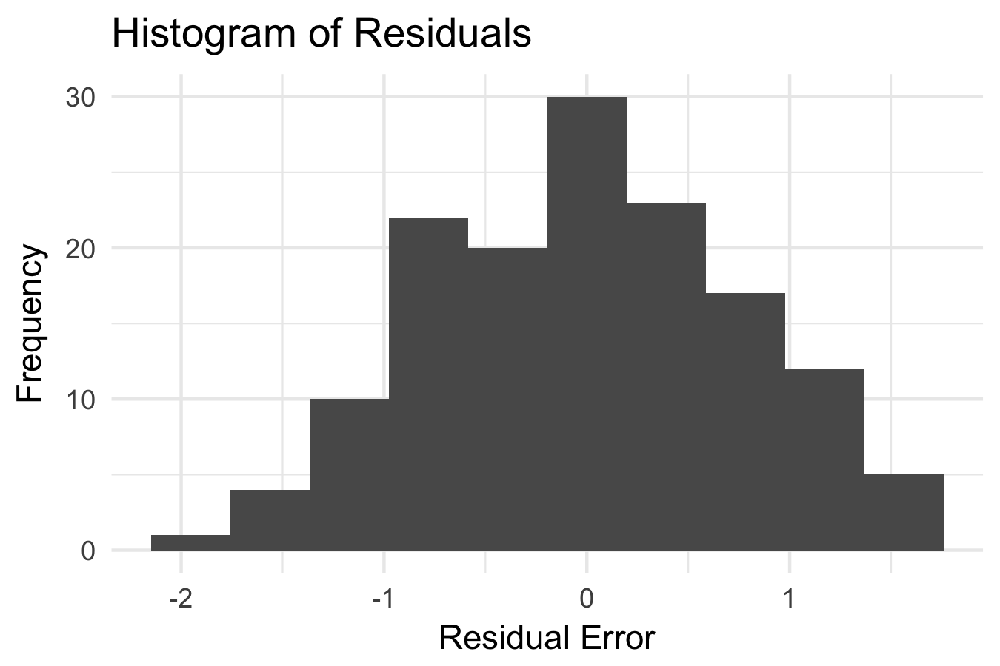

The histogram shows that the residuals are distributed between values -2 and 2. They almost follow a normal distribution which is in line with the assumptions made for a multiple regression model.

That being said, the 8th model now becomes our final model.

Conclusion
----------

After having created and tested 8 different models, our final model is:

*L**i**f**e**E**x**p**e**c**t**a**n**c**y* = 67.32 + 0.6468 \* *l**o**g*(*G**D**P*)−115.689 \* *C**h**i**l**d**M**o**r**t**a**l**i**t**y* − 1.561 \* *A**f**r**i**c**a* − 0.821 \* *A**s**i**a* − 42.21 \* *M**o**r**t**a**l**i**t**y*

The final model represents that over 98% of movement in the *Life Expectancy* for a country can be predicted with whether the country is based in *Africa* or *Asia* and using a few basic statistics such as *Child Mortality Rate*, *Mortality Rate*, *GDP per Capita*, and the *BMI* of the population.

We can see that *Africa* is included as a significant variable because of the abysmal state of social affairs in that continent in general. Given that health conditions such as Ebola and deaths due to diseases are widespread in the area, the population in general does not tend to live as long as those in other countries.

The presence of *Asia* also is not surprising due to a similar reason. Since most of the countries in Asia are developing, the state of affairs are similar to those in Africa with the exception of Japan which has a high life expectancy (Japan was removed as it was an outlier in the data).

*Child Mortality Rate* may play a major influence as the number of children dying under the age of 5 may serve as a proxy for the state of the healthcare system in that country, which may go on the affect the health of the surviving population while growing up, contributing to lowering the expected life.

*Mortality Rate* may also influence the life expectancy as this indicates the proportion of the population that dies between the ages of 15 and 60 years. The more people die within this age group, the lower the life expectancy would be as a certain percentage of the population has already died.

*GDP per Capita* represents the general well-being of the population which may also reflect the development of the country. This is again important as the higher the GDP per Capita for a country, the more resources the population would have to access better healthcare, thereby improving the expected life for the population.
