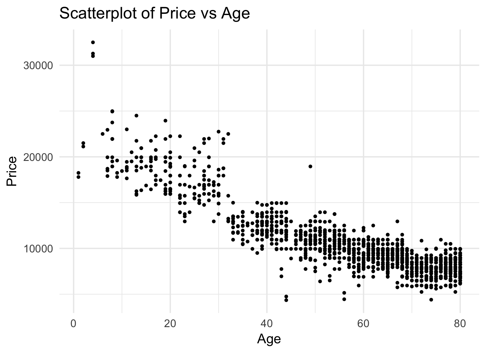
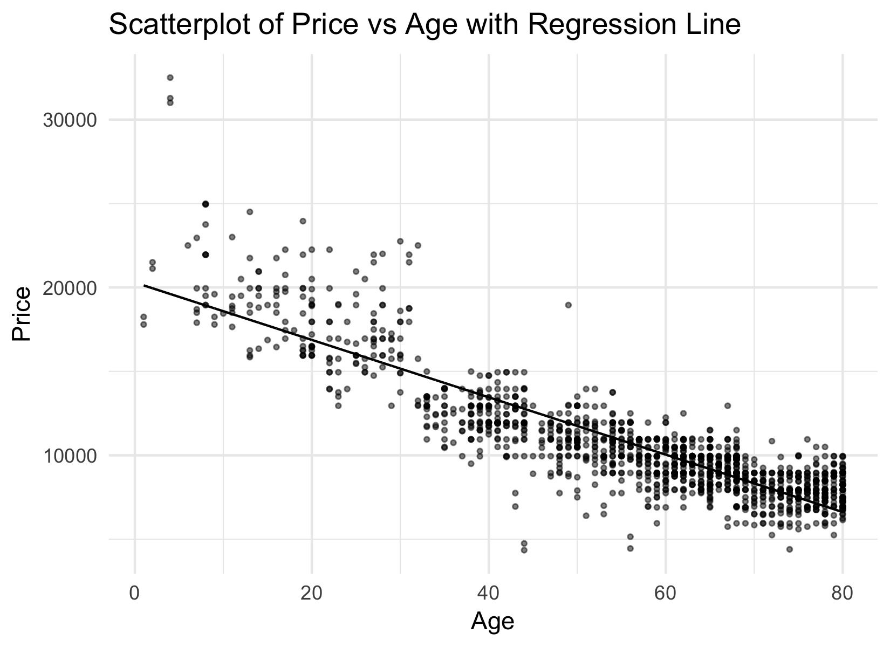
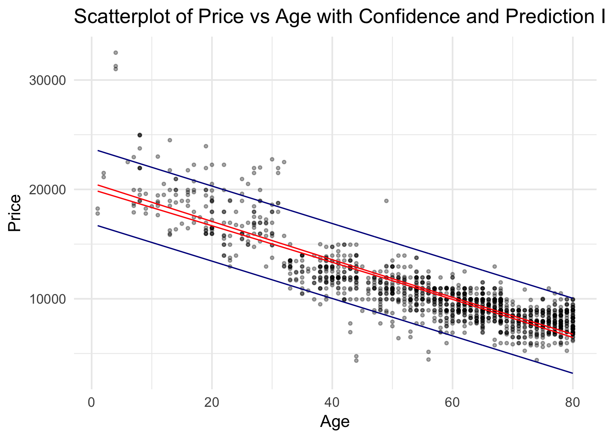
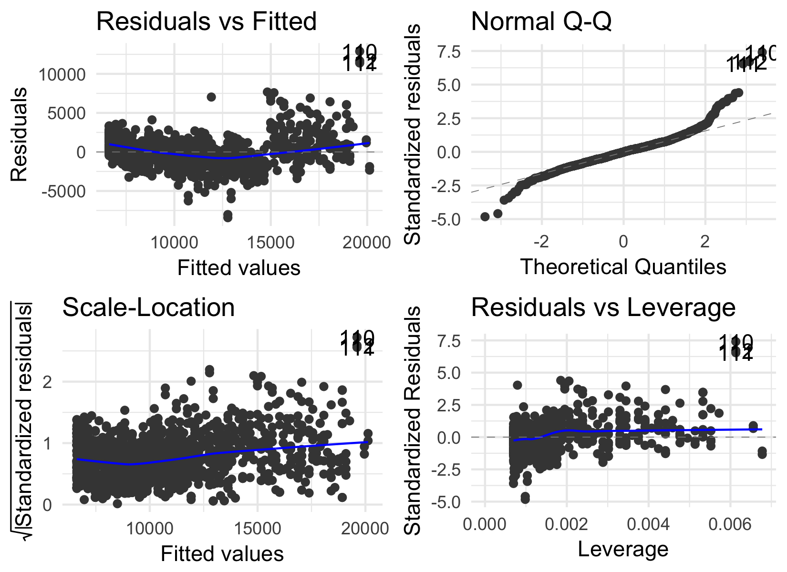
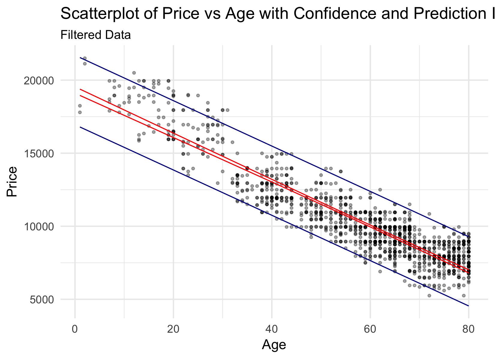
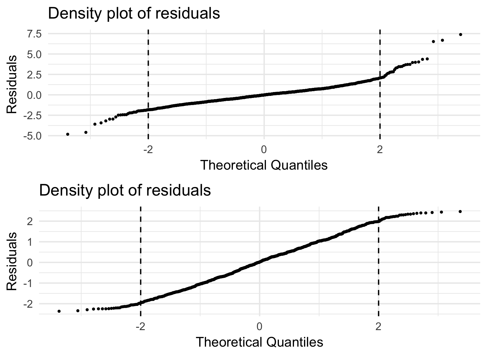
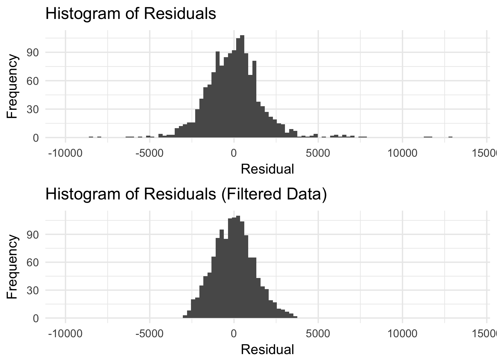

Simple Linear Regression Analysis
================
Tanmay Gupta
2/27/2018

The Analysis of the Single Variable
-----------------------------------

#### INTRODUCTION

The dataset I will be analyzing today is a dataset of Toyota car prices with respect to various factors that may impact their price. The main purpose is to find a variable within the dataset and use the change in its value to associate with the change in the price of that car. Throughout my analysis, I will be using R packages which will be used for the visualizations, regression modeling, and data analysis. The dataset consists of 1436 rows and 42 predictor variables. Since the data has 42 predictor variables, I will first run an analysis to find which predictor is the best to conduct a simple regression analysis with. Following is the command to find the 2 best predictors for running our regression analysis with. The significant variables are indicated with a " \* ". It also gives us a good idea of the way the predictors are distributed:

    ## Reordering variables and trying again:

``` r
best_subset_summary$outmat
```

    ##          KM  Fuel_TypeDiesel Fuel_TypePetrol HP  Met_Color ColorBlack
    ## 1  ( 1 ) " " " "             " "             " " " "       " "       
    ## 2  ( 1 ) " " " "             " "             " " " "       " "       
    ## 3  ( 1 ) "*" " "             " "             " " " "       " "       
    ##          ColorBlue ColorGreen ColorGrey ColorRed ColorSilver ColorViolet
    ## 1  ( 1 ) " "       " "        " "       " "      " "         " "        
    ## 2  ( 1 ) " "       " "        " "       " "      " "         " "        
    ## 3  ( 1 ) " "       " "        " "       " "      " "         " "        
    ##          ColorWhite ColorYellow Automatic cc  Doors Cylinders Gears
    ## 1  ( 1 ) " "        " "         " "       " " " "   " "       " "  
    ## 2  ( 1 ) " "        " "         " "       " " " "   " "       " "  
    ## 3  ( 1 ) " "        " "         " "       " " " "   " "       " "  
    ##          Quarterly_Tax Weight Mfr_Guarantee BOVAG_Guarantee
    ## 1  ( 1 ) " "           " "    " "           " "            
    ## 2  ( 1 ) " "           " "    " "           " "            
    ## 3  ( 1 ) " "           "*"    " "           " "            
    ##          Guarantee_Period ABS Airbag_1 Airbag_2 Airco Automatic_airco
    ## 1  ( 1 ) " "              " " " "      " "      " "   " "            
    ## 2  ( 1 ) " "              " " " "      " "      " "   "*"            
    ## 3  ( 1 ) " "              " " " "      " "      " "   " "            
    ##          Boardcomputer CD_Player Central_Lock Powered_Windows
    ## 1  ( 1 ) " "           " "       " "          " "            
    ## 2  ( 1 ) " "           " "       " "          " "            
    ## 3  ( 1 ) " "           " "       " "          " "            
    ##          Power_Steering Radio Mistlamps Sport_Model Backseat_Divider
    ## 1  ( 1 ) " "            " "   " "       " "         " "             
    ## 2  ( 1 ) " "            " "   " "       " "         " "             
    ## 3  ( 1 ) " "            " "   " "       " "         " "             
    ##          Metallic_Rim Radio_cassette Tow_Bar Age
    ## 1  ( 1 ) " "          " "            " "     "*"
    ## 2  ( 1 ) " "          " "            " "     "*"
    ## 3  ( 1 ) " "          " "            " "     "*"

Having conducted the regression subset analysis, I found that "Age" of the car is the best predictor of the car's price.

#### REGRESSION MODEL BUILDING

Having said that, we now begin to explore the relationship between Price and Age to see if there is any predictive power in the data which will help us to understand the pattern in the data. To do that, we first begin by plotting the values of Price and Age against each other in a scatter plot.

Here is the scatter plot of the two variables (Price and Age):



There appears to be a strong linear relationship here between Price and Age, however, we can identify a couple of observations which seem to lie aloof of the general trend that runs through the dataset.

Having noted the linear relationship, following is the regression line that runs through the dataset points.



As noticed before, we can see that there are a considerable number of points that lie above and below the regression line. We will explore further whether they lie outside the prediction error interval in the coming few pages.

In the regression model below, you will see that the regression equation created takes the following form:

Price = 20294.06 - 170.93 \* ( Age )

Following is the output from the R console when called for the summary of the model:

    ## 
    ## Call:
    ## lm(formula = Price ~ Age, data = toy.x)
    ## 
    ## Residuals:
    ##     Min      1Q  Median      3Q     Max 
    ## -8423.0  -997.4   -24.6   878.5 12889.7 
    ## 
    ## Coefficients:
    ##              Estimate Std. Error t value Pr(>|t|)    
    ## (Intercept) 20294.059    146.097  138.91   <2e-16 ***
    ## Age          -170.934      2.478  -68.98   <2e-16 ***
    ## ---
    ## Signif. codes:  0 '***' 0.001 '**' 0.01 '*' 0.05 '.' 0.1 ' ' 1
    ## 
    ## Residual standard error: 1746 on 1434 degrees of freedom
    ## Multiple R-squared:  0.7684, Adjusted R-squared:  0.7682 
    ## F-statistic:  4758 on 1 and 1434 DF,  p-value: < 2.2e-16

The regression is strong, with an r2 of 76.8% and the F-statistic of 4758. We will, next, analyze through a Linear Hypothesis test whether the F-statistic is significant or not.

    ## Linear hypothesis test
    ## 
    ## Hypothesis:
    ## Age = 0
    ## 
    ## Model 1: restricted model
    ## Model 2: Price ~ Age
    ## 
    ##   Res.Df        RSS Df  Sum of Sq    F    Pr(>F)    
    ## 1   1435 1.8877e+10                                 
    ## 2   1434 4.3718e+09  1 1.4505e+10 4758 < 2.2e-16 ***
    ## ---
    ## Signif. codes:  0 '***' 0.001 '**' 0.01 '*' 0.05 '.' 0.1 ' ' 1

With the p-value of the F-statistic being close to 0, we can confirm that there is strong evidence that the model is statistically significant.

Upon further analysis of the regression summary, we find that the intercept is meaningful, representing the predicted value of the car when the car is 0 months old. The slope coefficient associates a fall in price of $170.63 of a car as that car ages by 1 month.

The following simple regression scatter plot displays the use of confidence intervals to show the accuracy of the estimate of the average Price for all members of the population for a given Age of the car. The prediction interval, in contrast, represents the accuracy of a prediction of the Price for a particular observation with a given Age value.



In this graph, we can see clearly see the difference between the confidence (red) and the prediction (dark blue) intervals for the regression model. We can observe that the confidence interval is much narrower than the prediction interval, primarily because of the fact that the prediction interval takes into account the innate variability of Price while the confidence interval only takes into account the variability in its prediction for ( ^0 + ^1 \* Age ) as an estimator for the ( 0 + 1 \* Age). Upon further observation, we can notice that the confidence interval is at its narrowest in the middle of the data, while broader toward its tails, which emphasizes on how the model is best at predicting values in a certain range and loses its accuracy as the data becomes more extreme.

For instance, if we were to take an example of a car with an age of 36 months (3 years), the following are the confidence and prediction intervals for that car:

    ##        Fit Confidence_lower Confidence_upper Pred_lower Pred_upper
    ## 1 14140.45         14007.89         14273.01   10712.82   17568.08

As we can see, the prediction interval (Prediction\_lower, Prediction\_upper) is remarkably broader than the confidence interval (Confidence\_lower, Confidence\_upper) for a given fitted value (Age = 36 months).

We will now explore the residual distribution through the data set.



Through the distribution of residuals, can notice that the data has a number of points which are unusual in their values. We know that these unusual residuals can have a major impact on the regression model fits, like the r2, F-statistic, and the t-statistic. This may be because of other factors that may affect a car's price such as its physical condition, color, fuel type etc. which are not explained by this simple regression model.

In the Normal Q-Q plot, we can also find non-linearity which serves as a visual aid for us to recognize when the residuals do not form a normal distribution, thereby showing that one of our prime assumptions that the residuals form a normal distribution is violated toward the tails. This tells us to create a new model which has a higher explanatory power and complies better with our assumptions.

#### REGRESSION MODEL WITH FILTERED DATA

Having said that, I will remove all points from the dataset which have a residual of more than 3000 and less than -3000. That will help us to get a better idea of the relation of the price with the age without the impact of unusual data points.

Following is the graph of the filtered dataset, with the confidence and prediction intervals drawn through the dataset.



From the first look at the graph, we can make out that a lot more data points lie within the prediction interval as from before the data was filtered. This adds predictive power to the model, which can be confirmed through the new regression model that is created with the filtered dataset. Following is the summary of the new regression model using the filtered data set:

    ## 
    ## Call:
    ## lm(formula = Price ~ Age, data = toy.new)
    ## 
    ## Residuals:
    ##     Min      1Q  Median      3Q     Max 
    ## -2904.2  -841.9     2.9   777.9  3572.2 
    ## 
    ## Coefficients:
    ##              Estimate Std. Error t value Pr(>|t|)    
    ## (Intercept) 19325.878    111.773  172.90   <2e-16 ***
    ## Age          -155.162      1.865  -83.22   <2e-16 ***
    ## ---
    ## Signif. codes:  0 '***' 0.001 '**' 0.01 '*' 0.05 '.' 0.1 ' ' 1
    ## 
    ## Residual standard error: 1207 on 1337 degrees of freedom
    ## Multiple R-squared:  0.8382, Adjusted R-squared:  0.8381 
    ## F-statistic:  6925 on 1 and 1337 DF,  p-value: < 2.2e-16

    ## Analysis of Variance Table
    ## 
    ## Response: Price
    ##             Df     Sum Sq    Mean Sq F value    Pr(>F)    
    ## Age          1 1.0085e+10 1.0085e+10  6925.2 < 2.2e-16 ***
    ## Residuals 1337 1.9471e+09 1.4563e+06                      
    ## ---
    ## Signif. codes:  0 '***' 0.001 '**' 0.01 '*' 0.05 '.' 0.1 ' ' 1

We get a new model for the filtered data which is:

Price = 19325.88 - 155.16 \* ( Age )

We can see that the r 2 has risen from 76.8% to 83.8%. We further analyze the ANOVA of the new model which gives us an F-statistic of 6925.2 and a p-value of 0. As the F-statistic increases, the less likely the observed difference is due to chance.

We will now explore the residual distribution of the new model. From the comparison below we can see that the filtered data has created a density graph which is less dispersed as compared to the previous model which gives us an idea of the better prediction power of the new model. We can observe that there are high scaled values of residuals in the unfiltered dataset which extends from -5 to 7.5 while in the case of filtered date, the new model makes predictions which give scaled residuals a little outside the interval of -2 and 2, and essentially follows a linear form.



We will also compare the distribution of residuals to analyze the change after the data is filtered.



We will now conduct a test of the new model by taking a sample car of Age = 36 months and compare it with the result we obtained previously through the unfiltered data.

    ##        Fit Confidence_lower Confidence_upper Pred_lower Pred_upper
    ## 1 13740.03         13638.82         13841.24    11370.5   16109.56

We can see that the value provided by the prediction model is more precise, in the sense that the variability in its value in terms of the range is lower than the one provided by the previous model.

#### CONCLUSION

Thus, we can conclude that the relationship between the two variables, as shown through the model, has considerably increased, and the probability of making an error when rejecting the null hypothesis for the F-statistic has decreased. The claim that the decreasing price of a Toyota car can be associated to its increasing age can be backed by the evidence provided in this analysis.

Fundamentally, it can be attributed to the decreasing physical attractiveness of an older car, outdated technology, older features etc. Furthermore, aspects such as the condition of the car, fuel type etc. can be better analyzed through other predictor variables in the dataset which we have not explored in this simple linear regression model. If we were to include other statistically significant variables in our model, then we might find a model which might be able to explain its pricing better, which will help us understand the data outliers which we conveniently filtered out to create the new model.
